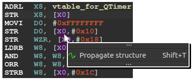
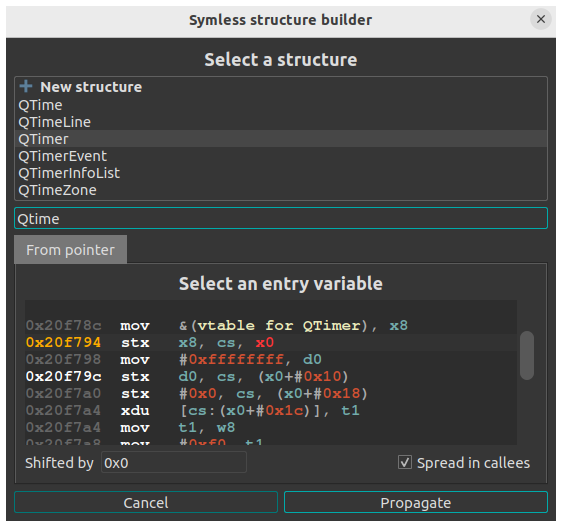

# Symless

An **IDA Pro plugin** that assists with **structure reconstruction**. Using static data-flow analysis to gather information, Symless automates most of the structure creation workflow. Its key features are:

* Inferring and creating structure fields based on access patterns
* Identifying and creating C++ virtual function tables
* Placing cross-references to link each structure field with the code that uses it

## Installation

```bash
$ python3 plugin/install.py [-u]
```

Or install manually: copy the [symless](symless/) directory and [symless_plugin.py](plugin/symless_plugin.py) file into your IDA plugins folder.

## Usage

The **interactive plugin** helps reconstruct a chosen structure. In the Disassembly or Pseudocode view, right-click a line that uses the structure you want to rebuild and select **Propagate structure** from the context menu:

<p align="center">
    <kbd>
        
    </kbd>
</p>

A form will appear prompting for:

* The **name of the new structure** to create, or an existing structure to extend.
* An **entry point** for the data-flow analysis, which is performed on the microcode. This entry point is a microcode operand that holds a pointer to the structure.

> [!NOTE]
> The microcode is IDA's intermediate representation (IR), generated from the CPU-specific assembly. Because of its similarity with the assembly, it is not difficult to read.

<p align="center">
    <kbd>
        
    </kbd>
</p>

Additional options are:

* **Shifted by**, the shift to apply to the structure pointer
* **Spread in callees**, whether the analysis should extend into called functions and discovered virtual methods

Clicking **Propagate** starts the analysis. The structure pointer is tracked from the selected entry, and observed accesses are used to infer structure fields.

> [!TIP]
> To get a more complete structure, run the analysis from the code that initializes the structure (for example, right after an allocation or inside a constructor).

The new structure is added to the Local Types view. Cross-references are added on assembly operands for each field access:

<p align="center">
    <kbd>
        
    </kbd>
</p>

You can then edit field types directly from the pseudocode. The plugin reduces the amount of back-and-forth navigation between disassembly, pseudocode and local types, required when creating structures and placing cross-references.

## CLI mode

An **automatic command-line** mode also exists, able to identify and automatically reconstruct most of the structures used in a binary. Symless uses two sources to discover structures:

* Dynamic memory allocations
* C++ virtual function tables and constructors

This automatic mode is intended as a pre-analysis step, to create structures and improve decompilation before manual work.

First, add the memory allocators used in your executable in [imports.csv](symless/config/imports.csv). This allows Symless to rebuild structures from dynamic allocations. If you don't, only C++ classes with virtual tables will be reconstructed.

The pre-analysis is ran using:

```bash
    $ python3 symless.py [-c config.csv] <target>
```

* ```config.csv``` - configuration file to use (defaults to [imports.csv](symless/config/imports.csv))
* ```target``` - a binary or an IDA database

if target is an executable, a new IDA database will be created. When the analysis finishes, the database is populated with the reconstructed structures.

### Limitations

The main challenge for the automatic analysis is resolving conflicts between structures. This can cause functions to be incorrectly typed, or duplicated structures to be created. In some cases it is better to use the interactive plugin, which is less prone to errors.

## Support

All architectures supported by your IDA decompiler are supported.

Supported IDA versions are **IDA 8.4 and later**.

## Credits

Thalium Team, and Célian Debéthune for working on the architecture-agnostic version during his internship at Thalium.
